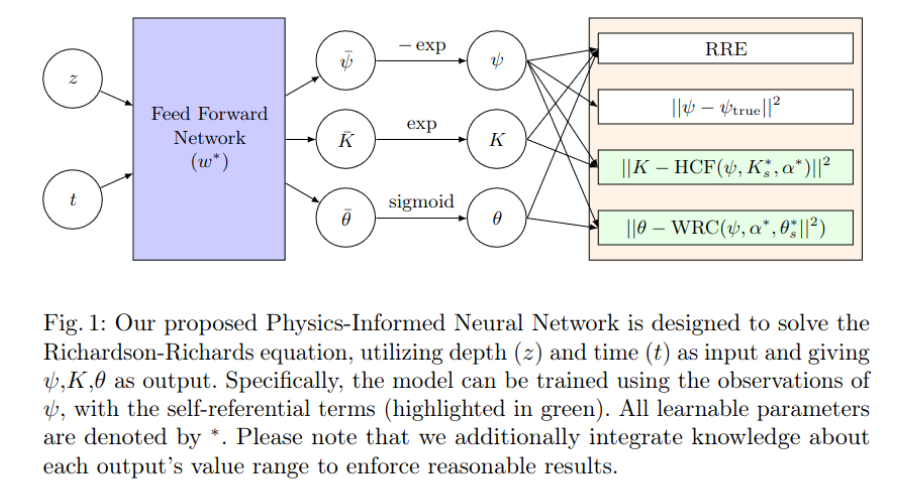

# RichardPINNs

Accompanying code for the manuscript "Estimating soil hydraulic parameters for unsaturated flow using Physics-Informed Neural Networks."

## Abstract

Water movement in soil is essential for weather monitoring, prediction of natural disasters, and agricultural water management. Richardson-Richards' equation (RRE) is the characteristic partial differential equation for studying soil water movement.
RRE is a non-linear PDE involving water potential, hydraulic conductivity, and volumetric water content.
This equation has underlying non-linear parametric relationships called water retention curves (WRCs) and hydraulic conductivity functions (HCFs).
This two-level non-linearity makes the problem of unsaturated water flow of soils challenging to solve. Physics-Informed Neural Networks (PINNs) offer a powerful paradigm to combine physics in data-driven techniques.
From noisy or sparse observations of one variable (water potential), we use PINNs to learn the complete system, estimate the parameters of the underlying model, and further facilitate the prediction of infiltration and discharge.
We employ training on RRE, WRC, HCF, and measured values to resolve two-level non-linearity directly instead of explicitly deriving water potential or volumetric water content-based formulations. 
The parameters to be estimated are made trainable with initialized values.
We take water potential data from simulations and use this data to solve the inverse problem with PINN and compare estimated parameters, volumetric water content, and hydraulic conductivity with actual values.
We chose different types of parametric relationships and wetting conditions to show the approach's effectiveness. 


## Graphical Abstract




## Information

The folder "Simulations" contains simulation codes for data generation and validation.

The folder "InversePINN_RRE" contains notebooks containing the implementation of PINNs for the Inverse problem of RRE, along with a text file containing required dependencies.   


## Citation

You can find the accompanying paper [here](https://link.springer.com/chapter/10.1007/978-3-031-63759-9_37).

```bibtext
@InProceedings{10.1007/978-3-031-63759-9_37,
  author="Vemuri, Sai Karthikeya and B{\"u}chner, Tim and Denzler, Joachim",
  editor="Franco, Leonardo
  and de Mulatier, Cl{\'e}lia
  and Paszynski, Maciej
  and Krzhizhanovskaya, Valeria V.
  and Dongarra, Jack J.
  and Sloot, Peter M. A.",
  title="Estimating Soil Hydraulic Parameters for Unsaturated Flow Using Physics-Informed Neural Networks",
  booktitle="Computational Science -- ICCS 2024",
  year="2024",
  publisher="Springer Nature Switzerland",
  address="Cham",
  pages="338--351",
  abstract="Water movement in soil is essential for weather monitoring, prediction of natural disasters, and agricultural water management. Richardson-Richards' equation (RRE) is the characteristic partial differential equation for studying soil water movement. RRE is a non-linear PDE involving water potential, hydraulic conductivity, and volumetric water content. This equation has underlying non-linear parametric relationships called water retention curves (WRCs) and hydraulic conductivity functions (HCFs). This two-level non-linearity makes the problem of unsaturated water flow of soils challenging to solve. Physics-Informed Neural Networks (PINNs) offer a powerful paradigm to combine physics in data-driven techniques. From noisy or sparse observations of one variable (water potential), we use PINNs to learn the complete system, estimate the parameters of the underlying model, and further facilitate the prediction of infiltration and discharge. We employ training on RRE, WRC, HCF, and measured values to resolve two-level non-linearity directly instead of explicitly deriving water potential or volumetric water content-based formulations. The parameters to be estimated are made trainable with initialized values. We take water potential data from simulations and use this data to solve the inverse problem with PINN and compare estimated parameters, volumetric water content, and hydraulic conductivity with actual values. We chose different types of parametric relationships and wetting conditions to show the approach's effectiveness.",
  isbn="978-3-031-63759-9"
}


```
